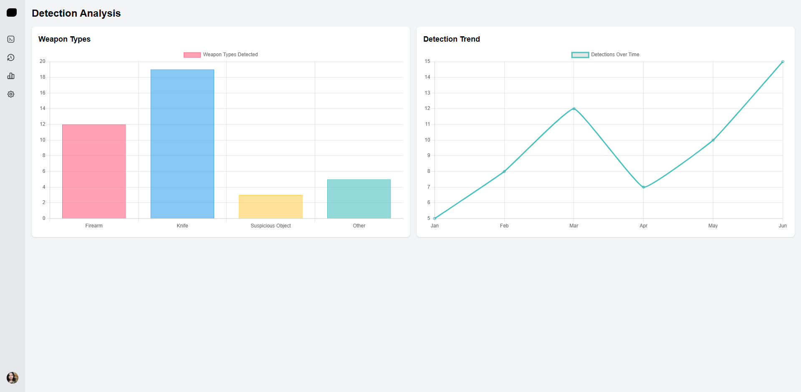

# Real-Time Weapon Detection System


A **real-time weapon detection system** built with Flask, YOLOv8, and OpenCV, designed for surveillance and security applications. This project processes live video feeds to detect weapons (e.g., guns, knives, suspicious objects), logs detections in a database, sends instant alerts via a web interface and SMS, and provides historical analysis of detected threats.

## Table of Contents

- [Project Overview](#project-overview)
- [Features](#features)
- [Screenshots](#screenshots)
- [Technologies Used](#technologies-used)
- [Model Training](#model-training)
- [Installation](#installation)
- [Usage](#usage)
- [API Endpoints](#api-endpoints)
- [Database Structure](#database-structure)
- [Contributing](#contributing)
- [License](#license)
- [Acknowledgements](#acknowledgements)

## Project Overview

This project leverages the power of **YOLOv8** for real-time object detection to identify weapons in video streams, making it suitable for enhancing security in public spaces like schools, malls, or airports. The system processes video feeds from a webcam or file, detects predefined weapon classes, and performs the following actions:

- **Logs Detections**: Stores details (timestamp, weapon type, location, screenshot) in a SQLite database.
- **Real-Time Alerts**: Notifies users instantly via a web interface (using WebSocket) and SMS (using Twilio).
- **Historical Analysis**: Provides APIs to retrieve past detections and analyze weapon distribution.
- **Screenshots**: Captures and saves images of detected weapons for evidence.

The backend is built with **Flask**, ensuring a robust and scalable server, while the frontend (assumed to be a separate React-based application) offers a user-friendly interface for monitoring.

## Features

- **Real-Time Weapon Detection**: Identifies guns, knives, and suspicious objects in live video with high accuracy.
- **Live Video Streaming**: Displays annotated video feed with bounding boxes around detected weapons.
- **Instant Notifications**:
  - Web alerts via Flask-SocketIO for immediate user updates.
  - SMS alerts via Twilio, including weapon details and timestamp.
- **Database Storage**: Logs all detections in SQLite for record-keeping.
- **Historical Data Access**: API to retrieve past detections for review.
- **Weapon Distribution Analysis**: API to analyze the frequency of different weapon types.
- **Cooldown Mechanism**: Prevents duplicate alerts for the same detection event (60-second cooldown).
- **Screenshot Capture**: Saves images of detected weapons for evidence or investigation.

## Screenshots

Below are examples of the project's dashboard, notifications, table, and graph:


*The live video stream and real-time alerts displayed on the web interface.*


*A table summarizing past weapon detection events with timestamps and details.*


*A graph visualizing the distribution of detected weapon types over time.*


*An SMS alert sent via Twilio, showing detected weapons and timestamp.*

## Technologies Used

### Backend
- **Python 3.8+**: Core programming language.
- **Flask**: Web framework for server-side logic and API endpoints.
- **Flask-SocketIO**: Enables real-time WebSocket communication for alerts.
- **Flask-SQLAlchemy**: Manages SQLite database interactions.
- **Flask-CORS**: Supports cross-origin requests from the frontend.
- **Ultralytics YOLOv8**: Object detection model for identifying weapons.
- **OpenCV (cv2)**: Handles video capture and frame processing.
- **Twilio**: Sends SMS notifications for detected threats.
- **Threading**: Ensures non-blocking SMS sending.

### Database
- **SQLite**: Lightweight database for storing detection records.

### Frontend (Assumed)
- **React/Vue/Angular**: Likely used for the client-side interface (running at `http://localhost:3000`).
- **Socket.IO Client**: Receives real-time detection alerts.
- **Axios/Fetch**: Makes HTTP requests to backend APIs.

## Model Training

The core of the detection system is a custom-trained **YOLOv8** model (`my_model.pt`), developed to recognize specific weapon classes: `gun`, `knife`, `suspicions_object`, and `explosive`.

### Training Process
- **Dataset**: Over **2000 images** were collected, covering various scenarios with weapons in different lighting conditions, angles, and backgrounds.
- **Annotation Tool**: Images were annotated using **Label Studio**, a powerful open-source tool for labeling bounding boxes around weapons. Each image was carefully labeled to ensure accurate class assignments.
- **Training Environment**: The YOLOv8 model was trained using the Ultralytics framework, leveraging a GPU for faster processing.
- **Parameters**:
  - **Epochs**: 40 (adjusted based on convergence).
  - **Batch Size**: 16.
  - **Image Size**: 640x640 pixels.
  - **Optimizer**: AdamW.
- **Outcome**: The resulting model achieves high precision and recall, suitable for real-time surveillance applications.

The training dataset was split into **80% training**, **10% validation**, and **10% testing** sets to ensure robust performance. The model was fine-tuned to minimize false positives, particularly in crowded or complex scenes.

## Installation

Follow these steps to set up the project locally.

### Prerequisites
- Python 3.8 or higher
- Git
- A Twilio account for SMS notifications
- A video source (webcam or video file, e.g., `guns1.mp4`)

### Steps
1. **Clone the Repository**:
   ```bash
   git clone https://github.com/Nihal-Kappungal/Real-Time-Weapon-Detection-System-Using-YOLO.git
   cd project-WeaponDetection/backend
   ```
2. **Create a Virtual Environment**:
   ```bash
   python -m venv venv
   source venv/bin/activate  # On Windows: venv\Scripts\activate
   ```
3. **Install Dependencies**:
   ```bash
   pip install -r requirements.txt
   ```
4. **Set Up Twilio Credentials**:

   Update app.py with your Twilio credentials:
   ```bash
   TWILIO_ACCOUNT_SID = 'your_account_sid'
   TWILIO_AUTH_TOKEN = 'your_auth_token'
   TWILIO_PHONE_NUMBER = '+1234567890'
   USER_PHONE_NUMBER = '+0987654321'
   ```
5. **Set Up Twilio Credentials**:
   
   - For webcam: Ensure cap = cv2.VideoCapture(0) in app.py.
   - For video file: Update to cap = cv2.VideoCapture('path/to/video.mp4')
   
6. **Run the backend**:
   - The server will start at http://localhost:5000.
  ```bash
    python app.py
  ```
7. **Run the backend**:
   - If you have a frontend, follow its setup instructions (e.g., npm install && npm start for a React app).
  ```bash
    npm install
    npm run dev
  ```
## Usage

1. **Start the Application**:
     - Run `python app.py` to launch the Flask server.
     - The video stream begins processing, and detections are logged.

2. **Access the Web Interface**:
     - Open `http://localhost:3000` (assuming your frontend is running there) to view the live stream and alerts.
     - Alternatively, visit `http://localhost:5000/stream` to see the raw video feed.

3. **Receive Notifications**:
     - Real-time alerts appear in the frontend via WebSocket.
     - SMS notifications are sent to the configured phone number with weapon details and timestamp.

4. **Review Data**:
     - Access `http://localhost:5000/api/history` for past detections.
     - Use `http://localhost:5000/api/analysis/weapon-distribution` for weapon statistics.

## API Endpoints

| Endpoint                              | Method | Description                              | Response Example                                                                 |
|---------------------------------------|--------|------------------------------------------|----------------------------------------------------------------------------------|
| `/`                                   | GET    | Welcome message                          | `"Welcome to the Weapon Detection System"`                                       |
| `/stream`                             | GET    | Live video stream with annotations       | Multipart JPEG stream                                                            |
| `/screenshots/<filename>`             | GET    | Serves a screenshot file                 | Image file (`image/jpeg`)                                                        |
| `/api/history`                        | GET    | List of all detections                   | `{"detections": [{"id": 1, "date": "2025-04-09T10:15:23", "weapon_type": "gun", ...}]}` |
| `/api/analysis/weapon-distribution`   | GET    | Weapon type distribution                 | `{"labels": ["gun", "knife"], "data": [3, 2]}`                                  |

## Database Structure

The project uses a SQLite database (`database.db`) with a single table, `detection`, defined as follows:

| Column            | Type           | Description                                      |
|-------------------|----------------|--------------------------------------------------|
| `id`              | INTEGER        | Primary key, unique ID for each detection        |
| `timestamp`       | DATETIME       | Time of detection (UTC)                          |
| `weapon_type`     | VARCHAR(50)    | Type of weapon (e.g., 'gun', 'knife')            |
| `location`        | VARCHAR(50)    | Location of detection (e.g., 'Main Entrance')    |
| `screenshot_path` | VARCHAR(200)   | Path to the saved screenshot                     |

To inspect the database:
```bash
sqlite3 backend/database.db
sqlite> .schema detection
sqlite> SELECT * FROM detection;
```
## Contributing

Contributions are welcome! Please follow these steps:

1. Fork the repository.
2. Create a new branch (`git checkout -b feature/your-feature`).
3. Make your changes and commit (`git commit -m 'Add your feature'`).
4. Push to the branch (`git push origin feature/your-feature`).
5. Open a pull request.

Please ensure your code adheres to PEP 8 standards and includes relevant tests.

## License

This project is licensed under the [MIT License](LICENSE). Feel free to use, modify, and distribute it as per the license terms.

## Acknowledgements

- **Ultralytics Team**: For the YOLOv8 framework, enabling robust object detection.
- **Label Studio**: For providing an intuitive tool for dataset annotation.
- **Twilio**: For reliable SMS notification services.
- **Flask Community**: For maintaining a versatile web framework and extensions.

## Contact

For questions, feedback, or support, please reach out through the following channels:

- **Email**: [nihalkappungal.workspace@gmail.com](mailto:nihalkappungal.workspace@gmail.com)
- **GitHub Issues**: Open an issue on this repository at [github.com/Nihal-Kappungal/Real-Time-Weapon-Detection-System-Using-YOLO/issues](https://github.com/Nihal-kappungal/Real-Time-Weapon-Detection-System-Using-YOLO/issues)
- **LinkedIn**: Connect with the team at [linkedin.com/in/Nihal-k](https://www.linkedin.com/in/nihal-k-b07618258?utm_source=share&utm_campaign=share_via&utm_content=profile&utm_medium=android_app)

We value your input and aim to respond promptly to all inquiries.

